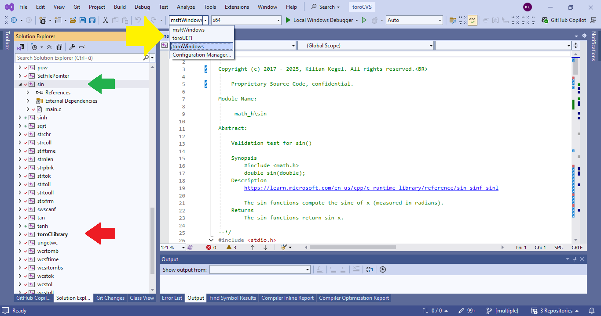
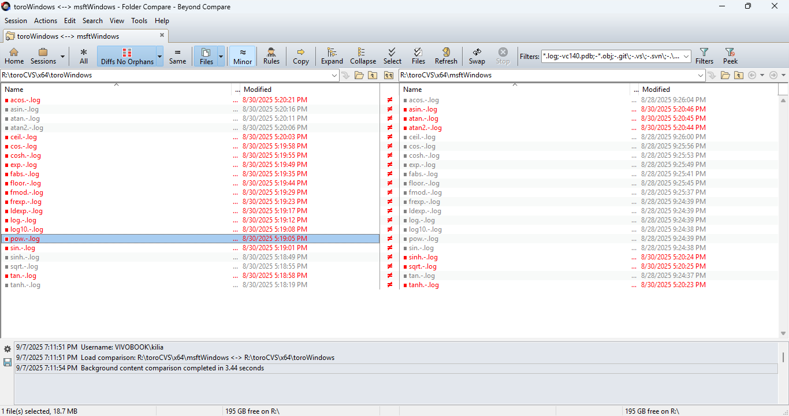
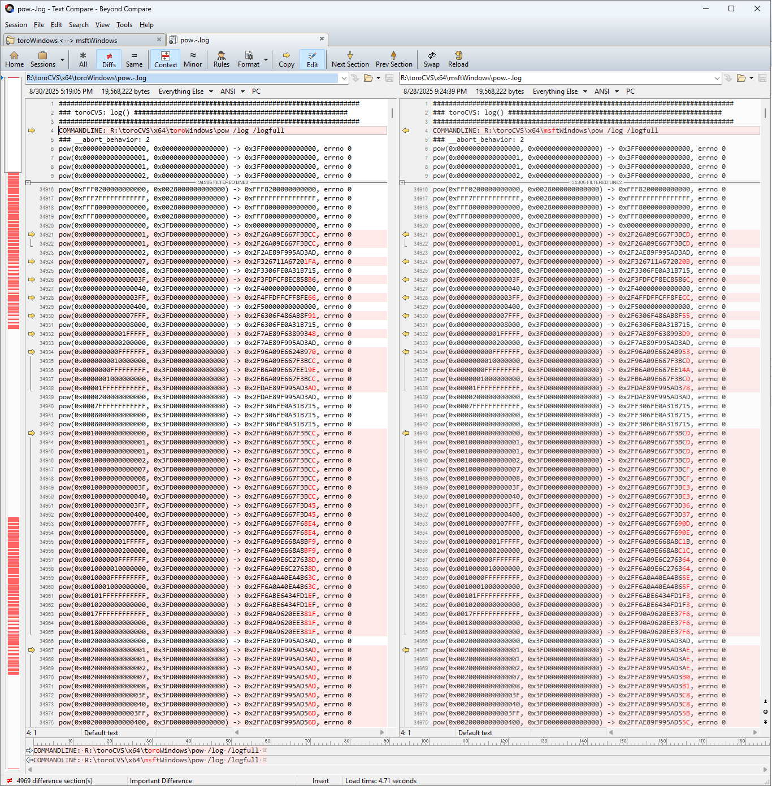

# toroCVSreport
toro C-Validation-Suite reports

### Table of content
* [Preface](README.md#Preface)
* [Basic concept](README.md#basic-concept)
* [Introduction: math.h](README.md#Introduction-math-h)
    * [Test results: math.h](README.md#testresults-mathh)

## Preface
**toroCVS** is a proprietary test suite to validate the **toro C Library**.

### Basic concept
The **toro C Library** is validated against the original **Microsoft C Library** in **Visual Studio 2022** — the **Microsoft C Library** is the reference implementation.

The **toro C Library** is a submodule of the **toroCVS** superproject. Each **toro C Library** function has a corresponding test module in **toroCVS**. Because modern PCs have high processing speed and large storage capacity, the test suite generally uses a brute-force strategy for validation.

The test suite generates the required test parameters, invokes the **DUT** (device under test — a math.h function) with these parameters, and reports the results to a .LOG file in the build folder.

The test is executed on both:
* **toro C Library**–linked test application
* **Microsoft C Runtime Library**–linked test application

# Introduction: math.h

Each .LOG file is inspected carefully to identify bugs and miscalculations. For **math.h** functions this is a challenging task because the results of floating-point calculations may differ in the low-significance bits yet still be correct. It is difficult to identify true miscalculations in millions of trace lines with around one million non-relevant differences.

These natural differences arise because the respective libraries use different arithmetic units: the **8087 FPU** versus the **SSE unit**. For example, for the **`pow()`** function:

## Test results: math.h
The test results of all **math.h** functions can be found here:

(to keep diff file size small, only 15 lines around differences are shown)

* [**acos()**](https://cdn.githubraw.com/KilianKegel/toroCVSreport/main/report/math_h/x64/acos.html)
* [**asin()**](https://cdn.githubraw.com/KilianKegel/toroCVSreport/main/report/math_h/x64/asin.html)
* [**atan()**](https://cdn.githubraw.com/KilianKegel/toroCVSreport/main/report/math_h/x64/atan.html)
* [**atan2()**](https://cdn.githubraw.com/KilianKegel/toroCVSreport/main/report/math_h/x64/atan2.html)
* [**ceil()**](https://cdn.githubraw.com/KilianKegel/toroCVSreport/main/report/math_h/x64/ceil.html)
* [**cos()**](https://cdn.githubraw.com/KilianKegel/toroCVSreport/main/report/math_h/x64/cos.html)
* [**cosh()**](https://cdn.githubraw.com/KilianKegel/toroCVSreport/main/report/math_h/x64/cosh.html)
* [**exp()**](https://cdn.githubraw.com/KilianKegel/toroCVSreport/main/report/math_h/x64/exp.html)
* [**fabs()**](https://cdn.githubraw.com/KilianKegel/toroCVSreport/main/report/math_h/x64/fabs.html)
* [**floor()**](https://cdn.githubraw.com/KilianKegel/toroCVSreport/main/report/math_h/x64/floor.html)
* [**fmod()**](https://cdn.githubraw.com/KilianKegel/toroCVSreport/main/report/math_h/x64/fmod.html)
* [**frexp()**](https://cdn.githubraw.com/KilianKegel/toroCVSreport/main/report/math_h/x64/frexp.html)
* [**ldexp()**](https://cdn.githubraw.com/KilianKegel/toroCVSreport/main/report/math_h/x64/ldexp.html)
* [**log()**](https://cdn.githubraw.com/KilianKegel/toroCVSreport/main/report/math_h/x64/log.html)
* [**log10()**](https://cdn.githubraw.com/KilianKegel/toroCVSreport/main/report/math_h/x64/log10.html)
* [**modf()**](https://cdn.githubraw.com/KilianKegel/toroCVSreport/main/report/math_h/x64/modf.html)
* [**pow()**](https://cdn.githubraw.com/KilianKegel/toroCVSreport/main/report/math_h/x64/pow.html)
* [**sin()**](https://cdn.githubraw.com/KilianKegel/toroCVSreport/main/report/math_h/x64/sin.html)
* [**sinh()**](https://cdn.githubraw.com/KilianKegel/toroCVSreport/main/report/math_h/x64/sinh.html)
* [**sqrt()**](https://cdn.githubraw.com/KilianKegel/toroCVSreport/main/report/math_h/x64/sqrt.html)
* [**tan()**](https://cdn.githubraw.com/KilianKegel/toroCVSreport/main/report/math_h/x64/tan.html)
* [**tanh()**](https://cdn.githubraw.com/KilianKegel/toroCVSreport/main/report/math_h/x64/tanh.html)